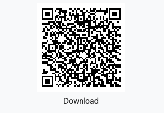
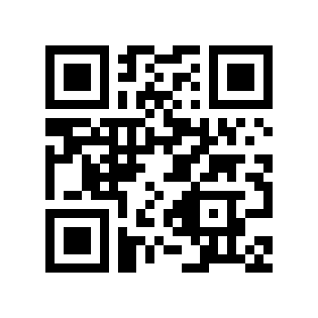
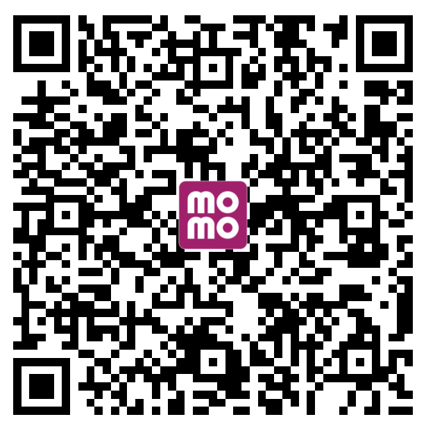

<h1 align="center">vrcode (Vue QR Code)</h1>

<p align="center">
  <a href="https://bundlephobia.com/result?p=@ispa.io/vrcode" target="_blank" rel="noopener noreferrer"></a>
  <a href="https://circleci.com/gh/malayvuong/vrcode/tree/dev"></a>
  <a href="https://npmcharts.com/compare/@ispa.io/vrcode?minimal=true"></a>
  <a href="https://www.npmjs.com/package/@ispa.io/vrcode"></a>
  <a href="https://www.npmjs.com/package/@ispa.io/vrcode"></a>
  <a href="https://m.me/malayvuong"></a>
</p>

A Vue component to generate QR Code and download.



## Table of contents

- [Getting started](#getting-started)
- [Props](#props)
- [Milestone](#milestone)
- [Versioning](#versioning)
- [License](#license)

## Getting started

### Install
```shell
npm i @ispa.io/vrcode
```

### Usage
```js
import Vue from 'vue';
import vrcode from '@ispa.io/vrcode'

Vue.component('vrcode', vrcode);

```
### Example
```html
<vrcode
    :download="{
        text: 'Download',
        filename: 'file-name.png',
        visible: true, type: 'image/png'
    }"
    value="A Vue component to generate QR Code and download."
    :options="{
        size: 200,
        level: 'Q'
    }"
></vrcode>
```

## Props

### value

- Type: `String` or `Object`
- Default: `undefined`

The value of the QR code. `Object` type used for some helpers tool below.

### download

Passing `download` props, to show download button, it support:

- Type: `Object`

- `text` - button inner text
- `visible` - setting download button visible or not
- `style` - setting download button style
- `class` - setting download button class name
- `type` - image type, such as image/png; use mime type for exactly force download
- `filename` - file name to download

You can only download the qrcode to image by using type: `canvas`

### type

- Type: `String`
- Default: `'canvas'`

You can use `canvas` or `svg`. But SVG not support to download now.

### options

- Type: `Object`
- Values:

  - `level`

    - Type: `String`
    - Default: `'L'`

    Possible levels are shown below:
    | Level            | Error resistance |
    |------------------|:----------------:|
    | **L** (Low)      | **~7%**          |
    | **M** (Medium)   | **~15%**         |
    | **Q** (Quartile) | **~25%**         |
    | **H** (High)     | **~30%**         |

  - `padding`

    - Type: `Number`
    - Default: `10`

    **This is padding border of image (Because users is difficult to scan with dark mode/dark background, so we need an white padding/border)**


  - `background`

    - Type: `String`
    - Default: `'#fff'`

  - `foreground`

    - Type: `String`
    - Default: `'#000'`

  - `className`

    - Type: `String`
    - Default: `''`

### helpers
#### What are helpers?
Helpers are an easy way to create QrCodes that cause a reader to perform a certain action when scanned.

#### Email
This helper generates an e-mail qrcode that is able to fill in the e-mail address, subject, and body.

Example:
```html
<vrcode
    :value="{
      address: 'email@example.com',
      subject: 'Hello',
      body: 'This is body'
    }"
    helpers="email"
></vrcode>
```

#### Call a number
This helper generates a QrCode that can be scanned and then dials a number.

Example:
```html
<vrcode
    value="+1 98-765-43-21"
    helpers="call"
></vrcode>
```

#### SMS (Text Messages)
This helper makes SMS messages that can be prefilled with the send to address and body of the message.

Example:
```html
<vrcode
    :value="{
      number: '+1 98-765-43-21',
      message: 'Hello, this message can be null'
    }"
    helpers="sms"
></vrcode>
```

#### Geo
This helper generates a latitude and longitude that a phone can read and opens the location in Google Maps or similar app.

Example:
```html
<vrcode
    :value="{
      lng: 10.7800965,
      lat: 106.6854548,
      name: 'QR Guiding'
    }"
    helpers="geo"
></vrcode>
```

#### Wifi
This helpers makes scannable QrCodes that can connect a phone to a WiFI network.

Example:
```html
<vrcode
    :value="{
      encrypt: 'WPA',
      ssid: 'Your SSID or Network Name',
      password: 'Your-Wifi-Password',
      hidden: true
    }"
    helpers="wifi"
></vrcode>
```
- `encrypt`: `WPA`, `WEP` or can be `null`
- `hidden`: `true` or `false`

#### Coin Wallet Address
This helper generates a scannable bitcoin (and other coins) to send payments.

Example:
```html
<vrcode
    :value="{
      coin: 'ethereum',
      address: '0x0000000000000000000000000000000000000000',
      amount: 0.00,
      message: 'Hello world'
    }"
    helpers="coin"
></vrcode>
```
- `coin`: default is `bitcoin`, you can change it by your own coin code (`ethereum`, `bitcoincash`, `dash`...)
- `coin`, `address`, `amount` has required
- `message` has not required.

#### Event
This helper generates a scannable event tag to add into calendar events.

Example:
```html
<vrcode
    :value="{
      name: 'Event name',
      allDay: false,
      start: '20200702T080000Z',
      end: '20200702T2030000Z',
      location: 'Event location',
      description: 'Event descriptions'
    }"
    helpers="event"
></vrcode>
```
- `allDay`: if set `true` => start and end has format: `20200702`
- `start` and `end`: timezone is UTC

## Milestone

- Transparent background
- PNG transparent background download
- With centered logo

## Versioning

Maintained under the [Semantic Versioning guidelines](https://semver.org/).

## License

[MIT](https://opensource.org/licenses/MIT) © [Malayvuong](https://malayvuong.com/)

## Invite me a cup of coffee
If you like this project and want to contribute us, then you can send us a cup of coffee by this ways below:

| PAYPAL.ME            | MOMO App (Vietnam) |
|:--------------------:|:------------------:|
|  |  |

[⬆ back to top](#table-of-contents)
